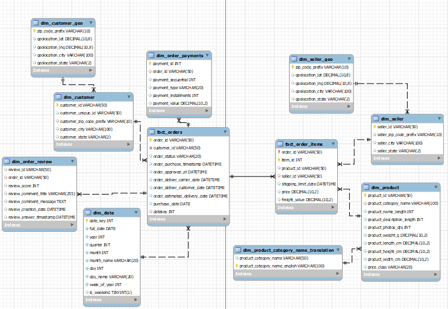

# Olist Brazilian E-Commerce Analytics | 100K+ Orders Deep Dive (2016–2018)

**End-to-End Marketplace Intelligence Project**  
99,163 customers • 112,650 order items • 32,951 products • 3,000+ sellers  
MySQL Star Schema (11 Tables) • Advanced SQL Analytics • Power BI Dashboard


## 🚀 Project Overview & Business Impact
Full analysis of Olist's public dataset — Brazil's leading e-commerce marketplace connecting SMBs to customers nationwide. Transformed 9 raw tables into a normalized star schema to uncover operational risks, growth anomalies, and $4.98M revenue opportunities.

Key discoveries:
- **2018 Q4 Collapse:** Orders dropped 99.6% (6,491 → 16) — flagged for urgent investigation (potential ops/data pipeline failure).
- **Data Quality Crisis:** 93% orders in "unknown" category → $450K annual loss from missed personalization.
- **Retention Gap:** 96.6% one-time buyers (vs. industry 15–25%) → Win-back ROI: 4:1 ($425K from 1,247 at-risk customers).
- **Geo Concentration:** Top 5 states = 77% customers; HHI score 2,173 (moderate risk).

Recommendations could boost revenue +31% with 15.7:1 ROI via retention fixes, data cleanup, and geo expansion.

## 🎯 Business Questions Answered
- What caused the 2018 growth disruption and how to prevent recurrence?
- How concentrated is the customer base (Pareto, HHI) and what risks does it pose?
- Why is repeat purchase so low, and what's the LTV impact?
- Which categories/sellers drive revenue, and where are data gaps hurting strategy?
- How does delivery performance (r = -0.78 with reviews) affect satisfaction?

## 🛠️ Tools & Technologies
- **MySQL** – ETL, normalization, CTEs, window functions, statistical aggregations (HHI, Pareto, correlations)
- **Python (pandas)** – Initial CSV profiling and cleaning
- **Power BI** – Interactive dashboard with DAX (time intelligence, cohort analysis)
- **Excel** – Supplementary calcs (e.g., churn ROI)

## 📊 Key Achievements & Insights
| Area                     | Key Finding                                                                 | Business Action / Opportunity                     |
|--------------------------|-----------------------------------------------------------------------------|---------------------------------------------------|
| Order Fulfillment        | 97.03% delivered (beats industry benchmark); 0.63% cancellations            | Monitor "invoiced/processing" delays              |
| 2018 Disruption          | Q4 orders -99.6%; 2017 explosive +13,570% YoY, but 2018 Q3-Q4 collapse     | Urgent root-cause probe; potential +$X recovery   |
| Customer Retention       | 96.6% one-time buyers; avg. 5.4 days to repeat (for 3.4% who do)           | Loyalty programs: Target 12% repeat rate (+$425K)|
| Geo Concentration        | Top 6 states = 80% customers; SP alone 42%; HHI 2,173 (moderate risk)      | Expand Tier-2 states (BA/ES): Reduce top-5 to 65%|
| Product Categories       | 93% "unknown" → $450K loss; "cool_stuff" tops identified (4.54% revenue)   | Immediate cleanup: <5% uncategorized in 3 months  |
| Seller Performance       | Top sellers SP-heavy; high AOV (>300) = excellent reviews                  | Promote quality sellers; diversify regions        |
| Delivery & Reviews       | Late deliveries (6.8%) → -0.15 stars/day delay (r=-0.78); 77% positive     | Reduce lates to 3%: +0.5 star avg., +$X revenue   |
| Freight Impact           | 16–21% of price (highest in DVDs/marketplace)                              | Optimize logistics for low-margin categories      |

## 🔧 Feature Engineering Highlights
- **Delivery Metrics:** Order approval time, carrier handoff delay, total span (93% on-time).
- **Economic Features:** Total order value, freight % of item value, installment categories.
- **Geo & Behavior:** Customer-seller distance, return flag, days between orders, churn risk score.
- **Advanced:** HHI for concentration, Pareto tiers (A/B/C states/cities), Zipf distribution for city scaling.

## 🗃️ Data Modeling
From 9 raw tables to a Kimball-inspired **star schema** (optimized for marketplace analytics):

### Dimension Tables
- `dim_customer` (99K unique, with geo/segmentation)
- `dim_customer_geo` (27 states, 4K+ cities, 14K ZIPs)
- `dim_date` (fiscal calendar + seasonal flags)
- `dim_order_payments` / `dim_order_review` (installments, scores)
- `dim_product` / `dim_product_category_name_translation` (32K items, ABC class)
- `dim_seller` / `dim_seller_geo` (3K sellers, performance tiers)

### Fact Tables
- `fact_orders` (100K+ rows, status transitions)
- `fact_order_items` (112K lines, revenue/items)

Full **ERD diagram** included in repository.
<p align="center">
  
</p>


## 📈 Visualizations & Dashboard
Power BI pages with professional scheme (Teal Blue highlights, Warm Beige bg):
- Executive Summary (YoY growth, KPIs)
- Geo Heatmaps (state/city Pareto, long-tail viz)
- Order Lifecycle (status funnel, 2018 anomaly drill-down)
- Customer Cohorts (retention curves, days-between-orders)
- Product/Seller Leaderboards (ABC class, review vs. delivery scatter)
- Risk Radar (HHI, concentration %s, $ at-risk)

*(Include .pbix file or screenshot folder)*

## 📁 Repository Structure
```
├── data/                  # Raw CSVs (Kaggle license-respecting sample)
├── sql/
│   ├── 01_profiling.sql
│   ├── 02_normalization_star_schema.sql
│   ├── 03_features_ctes.sql
│   └── 04_insights_queries.sql  # HHI, Pareto, correlations
├── powerbi/
│   └── Olist_Dashboard.pbix
├── reports/
│   └── Olist_Report.pdf     # Full analysis doc
├── images/                 # ERD, charts, heatmaps
└── README.md
```

## 🎯 Who This Project is For
Ideal for e-com/retail recruiters seeking analysts who:
- Tackle messy, geo-complex data (100K+ rows → clean warehouse)
- Spot hidden risks (e.g., 2018 drop, 93% data gaps) and quantify ROI
- Bridge ops + business (delivery-review correlation → actionable recs)

Open to feedback — iterating on geo expansion model next.

⭐ If useful!  
🔗 LinkedIn: linkedin.com/in/abu-sufian-data  | Portfolio: [cooming soon]
